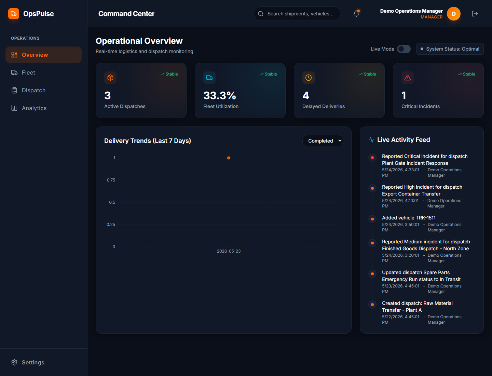

# OpsPulse - Intelligent Manufacturing Operations Platform

OpsPulse is a MERN stack operations platform for manufacturing logistics teams. It centralizes fleet visibility, dispatch coordination, incident reporting, and operational analytics that would otherwise be scattered across spreadsheets, chat groups, and manual tracking.

## Demo Login

Use these credentials after running the seed script:

```txt
Email: demo@opspulse.com
Password: OpsPulse@123
```

## Screenshots

Landing page assets and the dashboard preview are stored in `frontend/public`.



## Core Features

- JWT authentication with bcrypt password hashing.
- Protected dashboard, fleet, dispatch, and analytics routes.
- Fleet management with vehicle status, fuel level, capacity, driver, and wear metrics.
- Dispatch workflow with assignment, in-transit, delayed, and delivered states.
- Incident intelligence that categorizes reports, assigns risk, and suggests operational actions.
- Dashboard metrics, delivery trend chart, and live activity feed.
- Analytics view with delivery performance, incident distribution, and CSV export.
- Demo seed data for recruiter review and deployment smoke testing.
- Responsive dashboard shell with mobile navigation.

## Tech Stack

- Frontend: React, Vite, Tailwind CSS, React Router, Axios, Framer Motion, Recharts, Lucide React
- Backend: Node.js, Express, MongoDB, Mongoose, JWT, bcryptjs

## Project Structure

```txt
OpsPulse/
  frontend/   Vite React application
  server/     Express API, MongoDB models, seed script
```

## Environment Variables

Create `server/.env`:

```env
PORT=5000
MONGO_URI=your_mongodb_connection_string
JWT_SECRET=replace_with_a_long_random_secret
CLIENT_URL=http://localhost:5173
```

Create `frontend/.env`:

```env
VITE_API_URL=http://localhost:5000/api
```

Example files are included:

- `server/.env.example`
- `frontend/.env.example`

## Local Setup

Install and run the backend:

```bash
cd server
npm install
npm run seed
npm run start
```

Install and run the frontend:

```bash
cd frontend
npm install
npm run dev
```

Open the Vite URL, usually `http://localhost:5173`, and log in with the demo credentials above.

## Useful Scripts

Backend:

```bash
npm run start
npm run dev
npm run seed
```

Frontend:

```bash
npm run dev
npm run build
npm run lint
```

## API Overview

- `POST /api/auth/register`
- `POST /api/auth/login`
- `GET /api/dashboard`
- `GET /api/vehicles`
- `POST /api/vehicles`
- `PUT /api/vehicles/:id`
- `DELETE /api/vehicles/:id`
- `GET /api/dispatches`
- `POST /api/dispatches`
- `PUT /api/dispatches/:id/status`
- `POST /api/dispatches/:id/incident`

## Demo Data

`npm run seed` creates:

- one demo manager account
- six vehicles across available, in-transit, delayed, and maintenance states
- dispatches across pending, assigned, in-transit, delayed, and delivered states
- incidents with category, risk level, recommended action, and operational impact
- live activity feed records

The seed script resets the configured database collections so the dashboard is predictable for assessment review.

## Deployment Notes

Frontend can be deployed to Vercel or Netlify. Set:

```env
VITE_API_URL=https://your-backend-domain/api
```

Backend can be deployed to Render, Railway, or similar Node hosts. Set:

```env
MONGO_URI=your_production_mongo_uri
JWT_SECRET=your_production_secret
CLIENT_URL=https://your-frontend-domain
```

Run `npm run build` in `frontend` before deploying the client and `npm run start` in `server` for the API.
